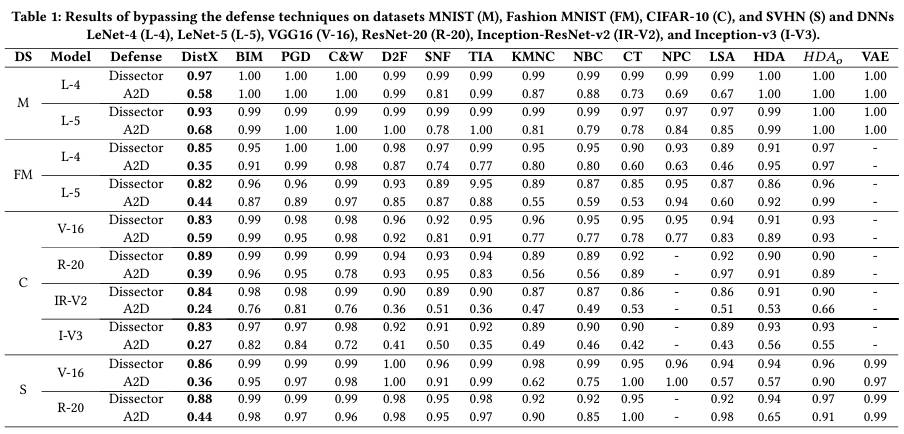

# DistXplore: Distribution guided testing tool for AI models
A distribution-guided approach for generating valid test cases with diverse distributions. Unlike existing testing techniques that optimize individual test cases, DistXplore optimizes test suites that represent specific distributions. For details about DistXplore, please refer to our [paper](https://dl.acm.org/doi/pdf/10.1145/3611643.3616266) accepted in FSE 2023 and our [website](https://sites.google.com/view/distxplore).

## Preformace of DistXplore


## Install
1. Clone code
```
git clone https://github.com/l1lk/Distribution-testing.git
cd ./Distribution-testing
```
2. Install dependence python packages
Install Pytorch, you can use the following command to install PyTorch version 1.13.1. For installing other versions, please refer to [this](https://pytorch.org/get-started/previous-versions/).
```
conda install pytorch==1.13.1 torchvision==0.14.1 torchaudio==0.13.1 pytorch-cuda=11.6 -c pytorch -c nvidia
```
Install dependence python packages.
```
pip install -r requirements.txt
```
## Usage
### Quickly run
We provide a script to generate distribution-aware test cases for LeNet-5 model trained on MNIST dataset.
```
sh generate_demo.sh
```
### Run on your own data and model
1. prepare seed suite and target suite

To run on your own data, you need to prepare npy-formatted seed suite and target suite. In the seed suite, there are N samples from the same class. Taking the MNIST dataset as an example with image shape (28, 28, 1), the seed suite is an ndarray with shape (N, 28, 28, 1). The target suite is similar but the samples come from another class. 

2. prepare data preprocess function

Modify the function **own_data_preprocessing()** on line 28 in AttackSet.py to adapt to your dataset.

3. Run the following command
```
python AttackSet.py -seeds seed_suite_file_path \
-gt groud_truth_of_seed_suite \
-target target_suite_file_path \
-target_class target_class_index \
-model model_path \
-o output_path \
-pop_num 100 \
-subtotal 50 \
-type own \
-max_iteration 30
```
- seeds: the file path of prepared seed suite
- gt: label file of prepared seed suite
- target: the file path of prepared target suite
- model: model path
- o: output path
- pop_num: Hyperparameters of GA, population size
- subtotal: Hyperparameters of GA, number of ind in each group
- type: run on your own data and model
- max_iteration: Hyperparameters of GA, Number of optimization iterations
4. Outputs
```plain
└── Distribution-testing
       ├── output_path
           ├── best_mmds
           ├── crashes
           ├── imgs
           └── plot.log
```
- best_mmds: Save the individual closest to the target distribution for each epoch.
- crashes: Save the misclassified cases generated in each epoch.
- imgs: Crashes in PNG format.
- plot.log: Record information for each iteration of the optimization process.
